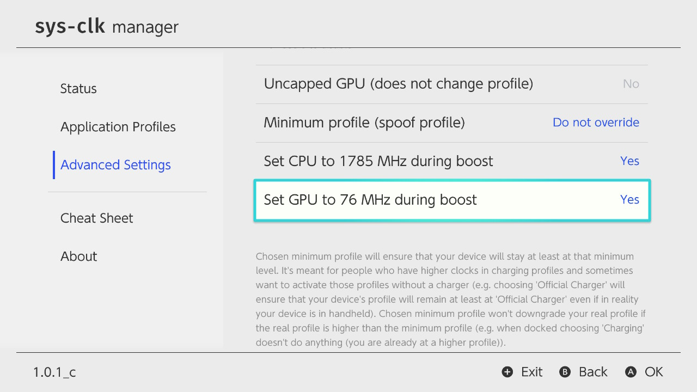
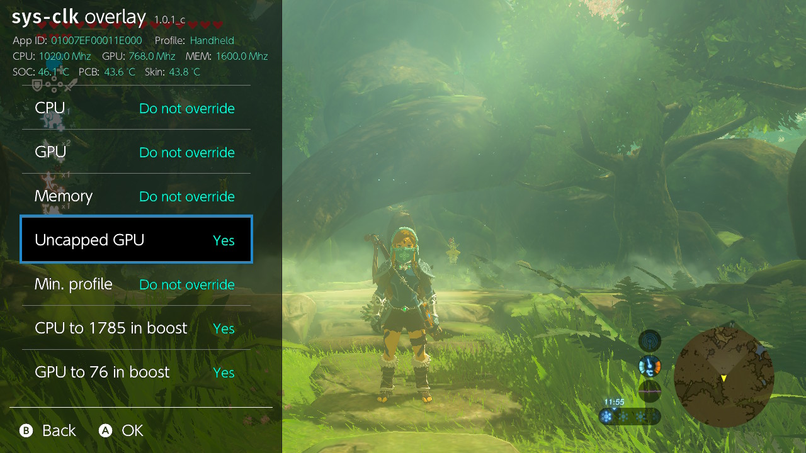

# sys-clk

Switch sysmodule allowing you to set cpu/gpu/mem clocks according to the running application and docked state.

## Installation

The following instructions assumes you have a Nintendo Switch running Atmosphère, updated to at least the latest stable version.
Copy the `atmosphere`, and `switch` folders at the root of your sdcard, overwriting files if prompted. Also copy the `config` folder if you're not updating, to include default settings.

**Note:** sys-clk-overlay requires to have [Tesla](https://gbatemp.net/threads/tesla-the-nintendo-switch-overlay-menu.557362/) installed and running

## Relevant files

* Config file allows one to set custom clocks per docked state and title id, described below

	`/config/sys-clk/config.ini`

* Log file where the logs are written if enabled

	`/config/sys-clk/log.txt`

* Log flag file enables log writing if file exists

	`/config/sys-clk/log.flag`

* CSV file where the title id, profile, clocks and temperatures are written if enabled

	`/config/sys-clk/context.csv`

* sys-clk manager app (accessible from the hbmenu)

	`/switch/sys-clk-manager.nro`

* sys-clk overlay (accessible from anywhere by invoking the [Tesla menu](https://gbatemp.net/threads/tesla-the-nintendo-switch-overlay-menu.557362/))

	`/switch/.overlays/sys-clk-overlay.ovl`
	
* sys-clk core sysmodule

	`/atmosphere/contents/00FF0000636C6BFF/exefs.nsp`
	`/atmosphere/contents/00FF0000636C6BFF/flags/boot2.flag`

## Config

Presets can be customized by adding them to the ini config file located at `/config/sys-clk/config.ini`, using the following template for each app 

```
[Application Title ID]
docked_cpu=
docked_gpu=
docked_mem=
handheld_charging_cpu=
handheld_charging_gpu=
handheld_charging_mem=
handheld_charging_usb_cpu=
handheld_charging_usb_gpu=
handheld_charging_usb_mem=
handheld_charging_official_cpu=
handheld_charging_official_gpu=
handheld_charging_official_mem=
handheld_cpu=
handheld_gpu=
handheld_mem=
```

* Replace `Application Title ID` with the title id of the game/application you're interested in customizing.
A list of games title id can be found in the [Switchbrew wiki](https://switchbrew.org/wiki/Title_list/Games).
* Frequencies are expressed in mhz, and will be scaled to the nearest possible values, described in the clock table below.
* If any key is omitted, value is empty or set to 0, it will be ignored, and stock clocks will apply.
* If charging, sys-clk will look for the frequencies in that order, picking the first found 
	1. Charger specific config (USB or Official) `handheld_charging_usb_X` or `handheld_charging_official_X`
	2. Non specific charging config `handheld_charging_X`
	3. Handheld config `handheld_X`

### Example 1: Zelda BOTW

* Overclock CPU when docked or charging
* Overclock MEM to docked clocks when handheld

Leads to a smoother framerate overall (ex: in the korok forest)

```
[01007EF00011E000]
docked_cpu=1224
handheld_charging_cpu=1224
handheld_mem=1600
```

### Example 2: Picross

* Underclocks on handheld to save battery

```
[0100BA0003EEA000]
handheld_cpu=816
handheld_gpu=153
handheld_mem=800
```

### Advanced

The `[values]` section allows you to alter timings in sys-clk, you should not need to edit any of these unless you know what you are doing. Possible values are:

| Key                     | Desc                                                                          | Default |
|:-----------------------:|-------------------------------------------------------------------------------|:-------:|
|**temp_log_interval_ms** | Defines how often sys-clk log temperatures, in milliseconds (`0` to disable)  | 0 ms    |
|**csv_write_interval_ms**| Defines how often sys-clk writes to the CSV, in milliseconds (`0` to disable) | 0 ms    |
|**poll_interval_ms**     | Defines how fast sys-clk checks and applies profiles, in milliseconds         | 300 ms  |


## Capping

To protect the battery from excessive strain, clocks requested from config may be capped before applying, depending on your current profile:

|       | Handheld | Charging (USB) | Charging (Official) | Docked |
|:-----:|:--------:|:--------------:|:-------------------:|:------:|
|**MEM**| -        | -              | -                   | -      |
|**CPU**| -        | -              | -                   | -      |
|**GPU**| 460      | 768            | -                   | -      |

## Clock table (MHz)

### MEM clocks
* 1600 → official docked, boost mode, max clock
* 1331 → official handheld
* 1065
* 800
* 665

### CPU clocks
* 1785 → max clock, boost mode
* 1683
* 1581
* 1428
* 1326
* 1224 → sdev oc
* 1122
* 1020 → official docked & handheld
* 918
* 816
* 714
* 612

### GPU clocks
* 921 → max clock
* 844
* 768 → official docked
* 691
* 614
* 537
* 460 → max handheld
* 384 → official handheld
* 307 → official handheld
* 230
* 153
* 76 → boost mode

**Notes:**
1. GPU overclock is capped at 460Mhz in handheld and capped at 768Mhz if charging, unless you're using the official charger.
2. Clocks higher than 768MHz need the official charger is plugged in.
